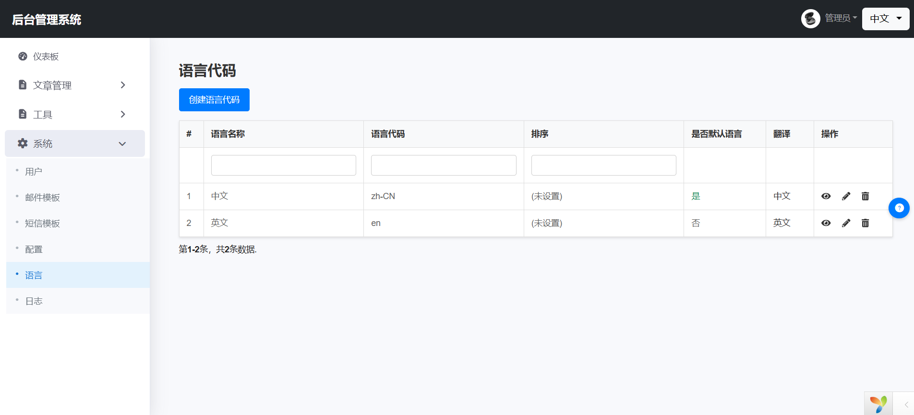
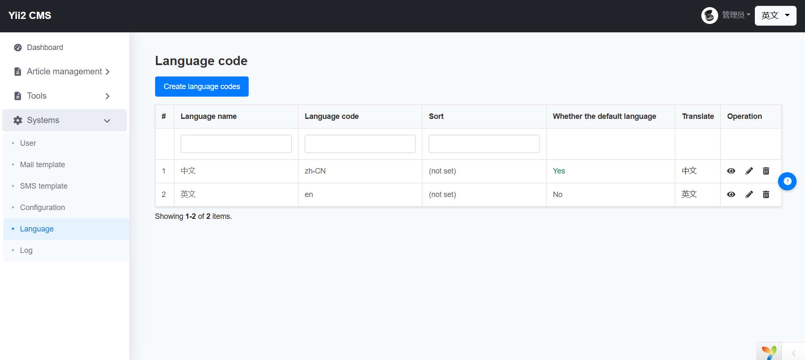
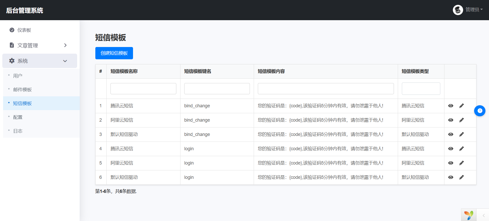
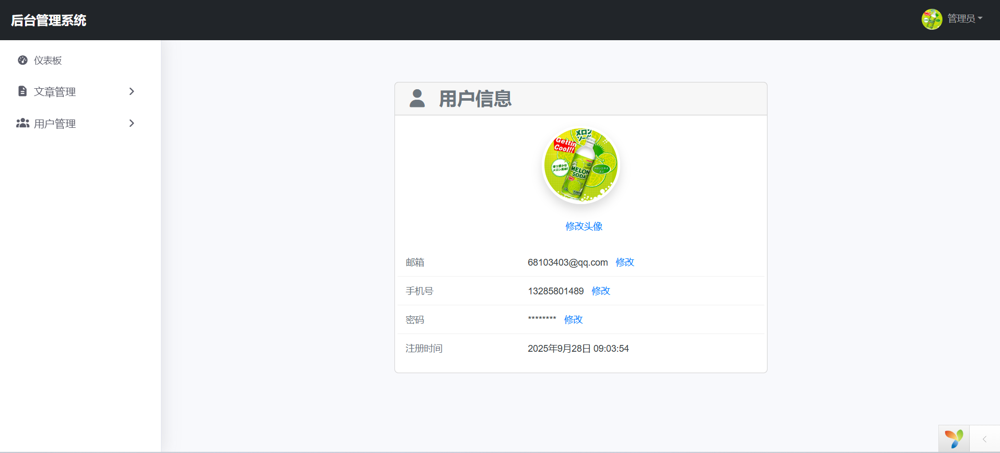
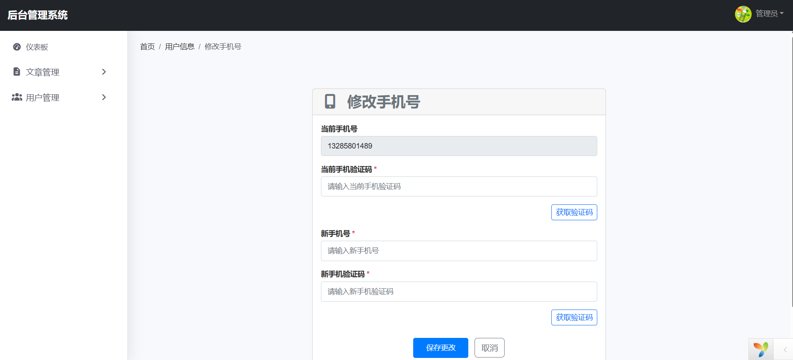
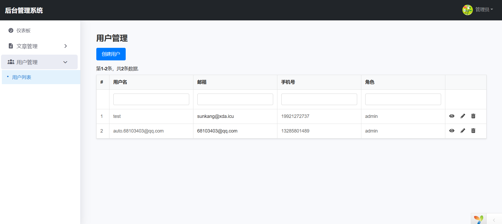
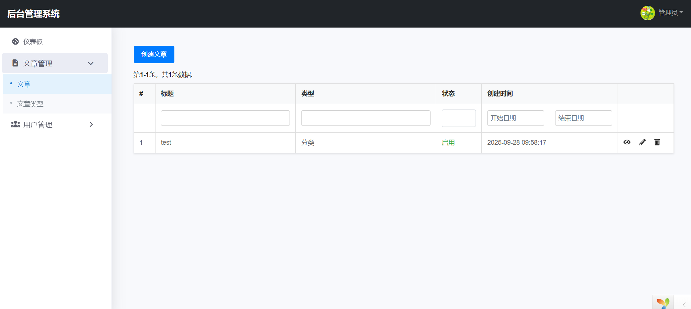
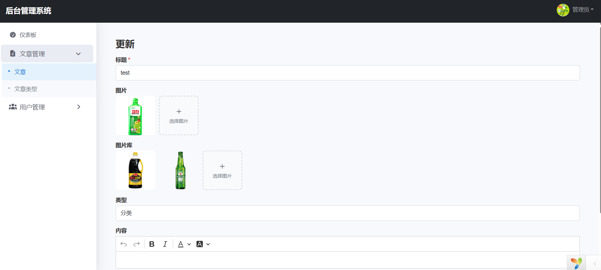

# yii2 

## 数据库

~~~
php yii migrate
~~~

## 配置nginx

~~~
location / {
    if (!-e $request_filename){
        rewrite ^(.*)$ /index.php last;
    }  
} 
~~~ 

## 功能

core

- 登录
- 修改密码
- 修改头像
- 设置、修改邮箱
- 设置、修改手机号
- 文章管理 
- 文章分类管理
- 用户管理
- 管理员权限
- 退出
- 短信模板
- 邮件模板
- 日志
- 配置
- 右侧帮助
- 多语言（界面翻译，默认中文、支持小牛自动翻译）
- 数据库多语言，在ActivRecord中添加多语言字段即可,参考 `app\modules\core\models\Post.php`
 
 

## 预览效果

## 包

- [yii2文档](https://www.yiiframework.com/doc/guide/2.0/zh-cn/concept-aliases)
- [nette/utils](https://doc.nette.org/en/utils/arrays)
- [微信、支付宝支付](https://pay.yansongda.cn/docs/v3/)
- [微信openid](https://easywechat.com/)
- [小牛翻译](https://niutrans.com/cloud/api/list)
- [fontawesome](https://fontawesome.com/)
